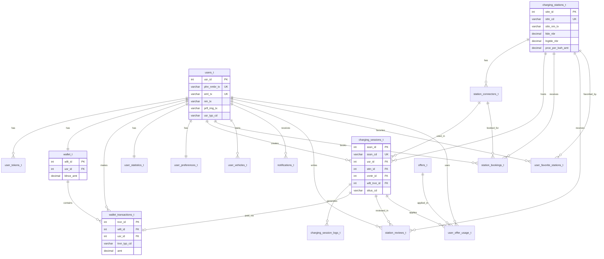

# 📊 DATABASE TABLE RELATIONS FLOWCHART

Complete visual representation of all table relationships in the EV Charging Station database.

---

## 🎯 ER DIAGRAM (Mermaid)



---

## 📋 RELATIONSHIP SUMMARY TABLE

| Parent Table | Child Table | Relationship Type | Foreign Key | Cascade |
|--------------|-------------|-------------------|-------------|---------|
| **users_t** | user_tokens_t | One-to-Many | usr_id | CASCADE |
| **users_t** | wallet_t | One-to-One | usr_id | CASCADE |
| **users_t** | wallet_transactions_t | One-to-Many | usr_id | CASCADE |
| **users_t** | user_statistics_t | One-to-One | usr_id | CASCADE |
| **users_t** | user_preferences_t | One-to-One | usr_id | CASCADE |
| **users_t** | charging_sessions_t | One-to-Many | usr_id | CASCADE |
| **users_t** | station_bookings_t | One-to-Many | usr_id | CASCADE |
| **users_t** | user_vehicles_t | One-to-Many | usr_id | CASCADE |
| **users_t** | notifications_t | One-to-Many | usr_id | CASCADE |
| **users_t** | station_reviews_t | One-to-Many | usr_id | CASCADE |
| **users_t** | user_favorite_stations_t | Many-to-Many | usr_id | CASCADE |
| **users_t** | user_offer_usage_t | One-to-Many | usr_id | CASCADE |
| **wallet_t** | wallet_transactions_t | One-to-Many | wllt_id | CASCADE |
| **charging_stations_t** | station_connectors_t | One-to-Many | sttn_id | CASCADE |
| **charging_stations_t** | charging_sessions_t | One-to-Many | sttn_id | CASCADE |
| **charging_stations_t** | station_bookings_t | One-to-Many | sttn_id | CASCADE |
| **charging_stations_t** | station_reviews_t | One-to-Many | sttn_id | CASCADE |
| **charging_stations_t** | user_favorite_stations_t | Many-to-Many | sttn_id | CASCADE |
| **station_connectors_t** | charging_sessions_t | One-to-Many | cnntr_id | - |
| **station_connectors_t** | station_bookings_t | One-to-Many | cnntr_id | - |
| **charging_sessions_t** | charging_session_logs_t | One-to-Many | sssn_id | CASCADE |
| **charging_sessions_t** | wallet_transactions_t | One-to-One | wllt_trxn_id | - |
| **charging_sessions_t** | station_reviews_t | One-to-Many | sssn_id | SET NULL |
| **charging_sessions_t** | user_offer_usage_t | One-to-Many | sssn_id | - |
| **offers_t** | user_offer_usage_t | One-to-Many | offr_id | CASCADE |

---

## 🔄 RELATIONSHIP FLOW DIAGRAM

```
┌─────────────────────────────────────────────────────────────────┐
│                        CORE ENTITIES                             │
└─────────────────────────────────────────────────────────────────┘

┌─────────────┐
│  users_t    │ ◄─── Central Hub Table
│  (usr_id)   │
└──────┬──────┘
       │
       ├──────────────────────────────────────────────────────────┐
       │                                                           │
       │  ONE-TO-ONE RELATIONSHIPS                                 │
       │                                                           │
       ├──► wallet_t (usr_id) ──┐                                 │
       │                         │                                 │
       ├──► user_statistics_t (usr_id)                            │
       │                                                           │
       ├──► user_preferences_t (usr_id)                           │
       │                                                           │
       │  ONE-TO-MANY RELATIONSHIPS                                │
       │                                                           │
       ├──► user_tokens_t (usr_id)                                │
       │                                                           │
       ├──► wallet_transactions_t (usr_id)                        │
       │    └──► wallet_t (wllt_id)                               │
       │                                                           │
       ├──► charging_sessions_t (usr_id)                          │
       │    ├──► charging_stations_t (sttn_id)                    │
       │    ├──► station_connectors_t (cnntr_id)                  │
       │    ├──► wallet_transactions_t (wllt_trxn_id)             │
       │    └──► charging_session_logs_t (sssn_id)                │
       │                                                           │
       ├──► station_bookings_t (usr_id)                           │
       │    ├──► charging_stations_t (sttn_id)                    │
       │    └──► station_connectors_t (cnntr_id)                  │
       │                                                           │
       ├──► user_vehicles_t (usr_id)                              │
       │                                                           │
       ├──► notifications_t (usr_id)                              │
       │                                                           │
       ├──► station_reviews_t (usr_id)                             │
       │    ├──► charging_stations_t (sttn_id)                    │
       │    └──► charging_sessions_t (sssn_id)                     │
       │                                                           │
       ├──► user_offer_usage_t (usr_id)                            │
       │    ├──► offers_t (offr_id)                                │
       │    └──► charging_sessions_t (sssn_id)                     │
       │                                                           │
       │  MANY-TO-MANY RELATIONSHIPS                                │
       │                                                           │
       └──► user_favorite_stations_t (usr_id)                      │
            └──► charging_stations_t (sttn_id)                    │
                                                                   │
┌──────────────────────────────────────────────────────────────────┘
│
│  STANDALONE TABLES
│
├──► auth_otp_t (no FK, linked by phn_nmbr_tx)
├──► audit_logs_t (usr_id nullable, no FK constraint)
└──► app_settings_t (no relationships)
```

---

## 🎨 VISUAL RELATIONSHIP MAP

### **Level 1: User Core**
```
                    ┌──────────────┐
                    │   users_t     │
                    │  (usr_id)     │
                    └───────┬───────┘
                            │
        ┌───────────────────┼───────────────────┐
        │                   │                   │
   ┌────▼────┐        ┌─────▼─────┐      ┌─────▼─────┐
   │ wallet_t│        │user_stats_t│      │user_prefs_t│
   │(wllt_id)│        │  (stt_id)  │      │  (prf_id)  │
   └────┬────┘        └────────────┘      └────────────┘
        │
        └──► wallet_transactions_t
```

### **Level 2: Charging Infrastructure**
```
┌──────────────────────┐
│ charging_stations_t  │
│     (sttn_id)        │
└──────────┬───────────┘
           │
    ┌──────┴──────┐
    │             │
┌───▼────┐  ┌────▼──────┐
│connectors│  │ sessions │
│(cnntr_id)│  │(sssn_id) │
└─────────┘  └────┬──────┘
                  │
         ┌────────┴────────┐
         │                 │
    ┌────▼────┐    ┌───────▼──────┐
    │  logs   │    │ transactions │
    │(log_id) │    │  (trxn_id)   │
    └─────────┘    └──────────────┘
```

### **Level 3: User Activities**
```
users_t
   │
   ├──► charging_sessions_t ──► charging_session_logs_t
   │         │
   │         └──► wallet_transactions_t
   │
   ├──► station_bookings_t
   │
   ├──► user_vehicles_t
   │
   ├──► station_reviews_t
   │
   ├──► notifications_t
   │
   └──► user_favorite_stations_t ──► charging_stations_t
```

### **Level 4: Offers & Rewards**
```
offers_t (offr_id)
   │
   └──► user_offer_usage_t
            │
            ├──► users_t (usr_id)
            └──► charging_sessions_t (sssn_id)
```

---

## 📊 RELATIONSHIP TYPES BREAKDOWN

### **1. One-to-One (1:1)**
- `users_t` → `wallet_t` (Each user has exactly one wallet)
- `users_t` → `user_statistics_t` (Each user has one statistics record)
- `users_t` → `user_preferences_t` (Each user has one preferences record)
- `charging_sessions_t` → `wallet_transactions_t` (Each session has one payment transaction)

### **2. One-to-Many (1:N)**
- `users_t` → `user_tokens_t` (User can have multiple tokens)
- `users_t` → `wallet_transactions_t` (User can have multiple transactions)
- `users_t` → `charging_sessions_t` (User can have multiple sessions)
- `users_t` → `station_bookings_t` (User can have multiple bookings)
- `users_t` → `user_vehicles_t` (User can have multiple vehicles)
- `users_t` → `notifications_t` (User can have multiple notifications)
- `users_t` → `station_reviews_t` (User can write multiple reviews)
- `users_t` → `user_offer_usage_t` (User can use multiple offers)
- `wallet_t` → `wallet_transactions_t` (Wallet can have multiple transactions)
- `charging_stations_t` → `station_connectors_t` (Station can have multiple connectors)
- `charging_stations_t` → `charging_sessions_t` (Station can host multiple sessions)
- `charging_stations_t` → `station_bookings_t` (Station can receive multiple bookings)
- `charging_stations_t` → `station_reviews_t` (Station can receive multiple reviews)
- `station_connectors_t` → `charging_sessions_t` (Connector can be used in multiple sessions)
- `station_connectors_t` → `station_bookings_t` (Connector can be booked multiple times)
- `charging_sessions_t` → `charging_session_logs_t` (Session can have multiple logs)
- `charging_sessions_t` → `station_reviews_t` (Session can have multiple reviews)
- `charging_sessions_t` → `user_offer_usage_t` (Session can apply multiple offers)
- `offers_t` → `user_offer_usage_t` (Offer can be used multiple times)

### **3. Many-to-Many (M:N)**
- `users_t` ↔ `charging_stations_t` via `user_favorite_stations_t`
  - A user can favorite multiple stations
  - A station can be favorited by multiple users

---

## 🔑 KEY RELATIONSHIPS EXPLAINED

### **User → Wallet → Transactions**
```
User creates → Wallet (auto-created) → Transactions (credit/debit)
```
- When a user is created, a wallet is automatically created
- All financial transactions are recorded in `wallet_transactions_t`
- Transactions reference both `wallet_t` and `users_t`

### **User → Session → Payment**
```
User starts → Charging Session → Wallet Transaction → Payment
```
- User initiates a charging session
- Session completion triggers wallet transaction
- Transaction links session to payment

### **Station → Connector → Session**
```
Station has → Connectors → Used in → Sessions
```
- Each station has multiple connector types
- Sessions use specific connectors
- Bookings can reserve specific connectors

### **User → Booking → Session**
```
User books → Station/Connector → Can convert to → Session
```
- Users can book stations in advance
- Bookings specify date, time, and connector
- Bookings can be converted to active sessions

### **Session → Review → Statistics**
```
Session completes → User reviews → Updates → Station rating & User stats
```
- Completed sessions can be reviewed
- Reviews update station average rating
- Statistics are aggregated from sessions

---

## 🔄 DATA FLOW EXAMPLES

### **Example 1: User Registration & Wallet Setup**
```
1. users_t (new user created)
   ↓
2. wallet_t (auto-created with balance 0)
   ↓
3. user_preferences_t (default preferences set)
   ↓
4. user_statistics_t (initialized with zeros)
```

### **Example 2: Charging Session Flow**
```
1. users_t → charging_sessions_t (session initiated)
   ↓
2. charging_sessions_t → station_connectors_t (connector reserved)
   ↓
3. charging_sessions_t → charging_session_logs_t (real-time updates)
   ↓
4. charging_sessions_t → wallet_transactions_t (payment on completion)
   ↓
5. wallet_transactions_t → wallet_t (balance updated)
   ↓
6. charging_sessions_t → user_statistics_t (stats updated via trigger)
   ↓
7. charging_sessions_t → station_reviews_t (optional review)
```

### **Example 3: Offer Application**
```
1. offers_t (active offer exists)
   ↓
2. charging_sessions_t (session created)
   ↓
3. user_offer_usage_t (offer applied to session)
   ↓
4. wallet_transactions_t (discount applied)
```

---

## 📌 IMPORTANT NOTES

1. **Cascade Deletes**: Most relationships use `ON DELETE CASCADE`, meaning deleting a user will delete all related records
2. **Soft Deletes**: Tables use `d_ts` (delete timestamp) for soft deletes rather than hard deletes
3. **Triggers**: Automated triggers update:
   - Station available chargers count
   - User statistics aggregation
4. **Indexes**: Foreign keys are indexed for performance
5. **Standalone Tables**: 
   - `auth_otp_t` - No FK, linked by phone number
   - `audit_logs_t` - No FK constraint (usr_id nullable)
   - `app_settings_t` - No relationships

---

## 🎯 QUERY PATTERNS

### **Get User with All Related Data**
```sql
SELECT * FROM users_t u
LEFT JOIN wallet_t w ON u.usr_id = w.usr_id
LEFT JOIN user_statistics_t s ON u.usr_id = s.usr_id
LEFT JOIN user_preferences_t p ON u.usr_id = p.usr_id
WHERE u.usr_id = ?
```

### **Get Session with Full Details**
```sql
SELECT * FROM charging_sessions_t s
JOIN users_t u ON s.usr_id = u.usr_id
JOIN charging_stations_t st ON s.sttn_id = st.sttn_id
JOIN station_connectors_t c ON s.cnntr_id = c.cnntr_id
LEFT JOIN wallet_transactions_t t ON s.wllt_trxn_id = t.trxn_id
WHERE s.sssn_id = ?
```

### **Get Station with All Related Data**
```sql
SELECT * FROM charging_stations_t st
LEFT JOIN station_connectors_t c ON st.sttn_id = c.sttn_id
LEFT JOIN station_reviews_t r ON st.sttn_id = r.sttn_id
WHERE st.sttn_id = ?
```

---

**Last Updated**: Generated from schema.sql
**Total Tables**: 20
**Total Relationships**: 25+

