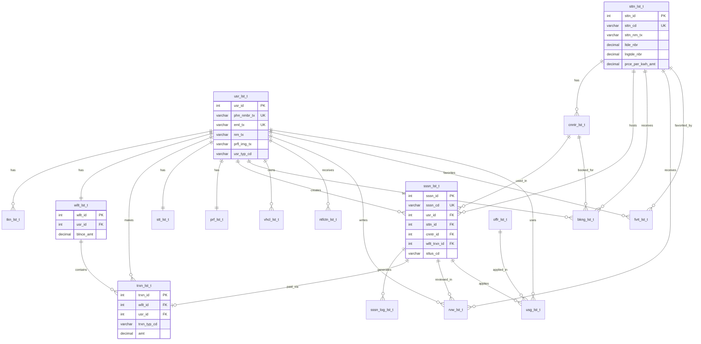

# 📊 DATABASE TABLE RELATIONS FLOWCHART

Complete visual representation of all table relationships in the EV Charging Station database.

---

## 🎯 ER DIAGRAM (Mermaid)



---

## 📋 RELATIONSHIP SUMMARY TABLE

| Parent Table | Child Table | Relationship Type | Foreign Key | Cascade |
|--------------|-------------|-------------------|-------------|---------|
| **usr_lst_t** | tkn_lst_t | One-to-Many | usr_id | CASCADE |
| **usr_lst_t** | wllt_lst_t | One-to-One | usr_id | CASCADE |
| **usr_lst_t** | trxn_lst_t | One-to-Many | usr_id | CASCADE |
| **usr_lst_t** | stt_lst_t | One-to-One | usr_id | CASCADE |
| **usr_lst_t** | prf_lst_t | One-to-One | usr_id | CASCADE |
| **usr_lst_t** | sssn_lst_t | One-to-Many | usr_id | CASCADE |
| **usr_lst_t** | bkng_lst_t | One-to-Many | usr_id | CASCADE |
| **usr_lst_t** | vhcl_lst_t | One-to-Many | usr_id | CASCADE |
| **usr_lst_t** | ntfctn_lst_t | One-to-Many | usr_id | CASCADE |
| **usr_lst_t** | rvw_lst_t | One-to-Many | usr_id | CASCADE |
| **usr_lst_t** | fvrt_lst_t | Many-to-Many | usr_id | CASCADE |
| **usr_lst_t** | usg_lst_t | One-to-Many | usr_id | CASCADE |
| **wllt_lst_t** | trxn_lst_t | One-to-Many | wllt_id | CASCADE |
| **sttn_lst_t** | cnntr_lst_t | One-to-Many | sttn_id | CASCADE |
| **sttn_lst_t** | sssn_lst_t | One-to-Many | sttn_id | CASCADE |
| **sttn_lst_t** | bkng_lst_t | One-to-Many | sttn_id | CASCADE |
| **sttn_lst_t** | rvw_lst_t | One-to-Many | sttn_id | CASCADE |
| **sttn_lst_t** | fvrt_lst_t | Many-to-Many | sttn_id | CASCADE |
| **cnntr_lst_t** | sssn_lst_t | One-to-Many | cnntr_id | - |
| **cnntr_lst_t** | bkng_lst_t | One-to-Many | cnntr_id | - |
| **sssn_lst_t** | sssn_log_lst_t | One-to-Many | sssn_id | CASCADE |
| **sssn_lst_t** | trxn_lst_t | One-to-One | wllt_trxn_id | - |
| **sssn_lst_t** | rvw_lst_t | One-to-Many | sssn_id | SET NULL |
| **sssn_lst_t** | usg_lst_t | One-to-Many | sssn_id | - |
| **offr_lst_t** | usg_lst_t | One-to-Many | offr_id | CASCADE |

---

## 🔄 RELATIONSHIP FLOW DIAGRAM

```
┌─────────────────────────────────────────────────────────────────┐
│                        CORE ENTITIES                             │
└─────────────────────────────────────────────────────────────────┘

┌─────────────┐
│  usr_lst_t    │ ◄─── Central Hub Table
│  (usr_id)   │
└──────┬──────┘
       │
       ├──────────────────────────────────────────────────────────┐
       │                                                           │
       │  ONE-TO-ONE RELATIONSHIPS                                 │
       │                                                           │
       ├──► wllt_lst_t (usr_id) ──┐                                 │
       │                         │                                 │
       ├──► stt_lst_t (usr_id)                            │
       │                                                           │
       ├──► prf_lst_t (usr_id)                           │
       │                                                           │
       │  ONE-TO-MANY RELATIONSHIPS                                │
       │                                                           │
       ├──► tkn_lst_t (usr_id)                                │
       │                                                           │
       ├──► trxn_lst_t (usr_id)                        │
       │    └──► wllt_lst_t (wllt_id)                               │
       │                                                           │
       ├──► sssn_lst_t (usr_id)                          │
       │    ├──► sttn_lst_t (sttn_id)                    │
       │    ├──► cnntr_lst_t (cnntr_id)                  │
       │    ├──► trxn_lst_t (wllt_trxn_id)             │
       │    └──► sssn_log_lst_t (sssn_id)                │
       │                                                           │
       ├──► bkng_lst_t (usr_id)                           │
       │    ├──► sttn_lst_t (sttn_id)                    │
       │    └──► cnntr_lst_t (cnntr_id)                  │
       │                                                           │
       ├──► vhcl_lst_t (usr_id)                              │
       │                                                           │
       ├──► ntfctn_lst_t (usr_id)                              │
       │                                                           │
       ├──► rvw_lst_t (usr_id)                             │
       │    ├──► sttn_lst_t (sttn_id)                    │
       │    └──► sssn_lst_t (sssn_id)                     │
       │                                                           │
       ├──► usg_lst_t (usr_id)                            │
       │    ├──► offr_lst_t (offr_id)                                │
       │    └──► sssn_lst_t (sssn_id)                     │
       │                                                           │
       │  MANY-TO-MANY RELATIONSHIPS                                │
       │                                                           │
       └──► fvrt_lst_t (usr_id)                      │
            └──► sttn_lst_t (sttn_id)                    │
                                                                   │
┌──────────────────────────────────────────────────────────────────┘
│
│  STANDALONE TABLES
│
├──► otp_lst_t (no FK, linked by phn_nmbr_tx)
├──► audt_lst_t (usr_id nullable, no FK constraint)
└──► sttng_lst_t (no relationships)
```

---

## 🎨 VISUAL RELATIONSHIP MAP

### **Level 1: User Core**
```
                    ┌──────────────┐
                    │   usr_lst_t     │
                    │  (usr_id)     │
                    └───────┬───────┘
                            │
        ┌───────────────────┼───────────────────┐
        │                   │                   │
   ┌────▼────┐        ┌─────▼─────┐      ┌─────▼─────┐
   │ wllt_lst_t│        │user_stats_t│      │user_prefs_t│
   │(wllt_id)│        │  (stt_id)  │      │  (prf_id)  │
   └────┬────┘        └────────────┘      └────────────┘
        │
        └──► trxn_lst_t
```

### **Level 2: Charging Infrastructure**
```
┌──────────────────────┐
│ sttn_lst_t  │
│     (sttn_id)        │
└──────────┬───────────┘
           │
    ┌──────┴──────┐
    │             │
┌───▼────┐  ┌────▼──────┐
│connectors│  │ sessions │
│(cnntr_id)│  │(sssn_id) │
└─────────┘  └────┬──────┘
                  │
         ┌────────┴────────┐
         │                 │
    ┌────▼────┐    ┌───────▼──────┐
    │  logs   │    │ transactions │
    │(log_id) │    │  (trxn_id)   │
    └─────────┘    └──────────────┘
```

### **Level 3: User Activities**
```
usr_lst_t
   │
   ├──► sssn_lst_t ──► sssn_log_lst_t
   │         │
   │         └──► trxn_lst_t
   │
   ├──► bkng_lst_t
   │
   ├──► vhcl_lst_t
   │
   ├──► rvw_lst_t
   │
   ├──► ntfctn_lst_t
   │
   └──► fvrt_lst_t ──► sttn_lst_t
```

### **Level 4: Offers & Rewards**
```
offr_lst_t (offr_id)
   │
   └──► usg_lst_t
            │
            ├──► usr_lst_t (usr_id)
            └──► sssn_lst_t (sssn_id)
```

---

## 📊 RELATIONSHIP TYPES BREAKDOWN

### **1. One-to-One (1:1)**
- `usr_lst_t` → `wllt_lst_t` (Each user has exactly one wallet)
- `usr_lst_t` → `stt_lst_t` (Each user has one statistics record)
- `usr_lst_t` → `prf_lst_t` (Each user has one preferences record)
- `sssn_lst_t` → `trxn_lst_t` (Each session has one payment transaction)

### **2. One-to-Many (1:N)**
- `usr_lst_t` → `tkn_lst_t` (User can have multiple tokens)
- `usr_lst_t` → `trxn_lst_t` (User can have multiple transactions)
- `usr_lst_t` → `sssn_lst_t` (User can have multiple sessions)
- `usr_lst_t` → `bkng_lst_t` (User can have multiple bookings)
- `usr_lst_t` → `vhcl_lst_t` (User can have multiple vehicles)
- `usr_lst_t` → `ntfctn_lst_t` (User can have multiple notifications)
- `usr_lst_t` → `rvw_lst_t` (User can write multiple reviews)
- `usr_lst_t` → `usg_lst_t` (User can use multiple offers)
- `wllt_lst_t` → `trxn_lst_t` (Wallet can have multiple transactions)
- `sttn_lst_t` → `cnntr_lst_t` (Station can have multiple connectors)
- `sttn_lst_t` → `sssn_lst_t` (Station can host multiple sessions)
- `sttn_lst_t` → `bkng_lst_t` (Station can receive multiple bookings)
- `sttn_lst_t` → `rvw_lst_t` (Station can receive multiple reviews)
- `cnntr_lst_t` → `sssn_lst_t` (Connector can be used in multiple sessions)
- `cnntr_lst_t` → `bkng_lst_t` (Connector can be booked multiple times)
- `sssn_lst_t` → `sssn_log_lst_t` (Session can have multiple logs)
- `sssn_lst_t` → `rvw_lst_t` (Session can have multiple reviews)
- `sssn_lst_t` → `usg_lst_t` (Session can apply multiple offers)
- `offr_lst_t` → `usg_lst_t` (Offer can be used multiple times)

### **3. Many-to-Many (M:N)**
- `usr_lst_t` ↔ `sttn_lst_t` via `fvrt_lst_t`
  - A user can favorite multiple stations
  - A station can be favorited by multiple users

---

## 🔑 KEY RELATIONSHIPS EXPLAINED

### **User → Wallet → Transactions**
```
User creates → Wallet (auto-created) → Transactions (credit/debit)
```
- When a user is created, a wallet is automatically created
- All financial transactions are recorded in `trxn_lst_t`
- Transactions reference both `wllt_lst_t` and `usr_lst_t`

### **User → Session → Payment**
```
User starts → Charging Session → Wallet Transaction → Payment
```
- User initiates a charging session
- Session completion triggers wallet transaction
- Transaction links session to payment

### **Station → Connector → Session**
```
Station has → Connectors → Used in → Sessions
```
- Each station has multiple connector types
- Sessions use specific connectors
- Bookings can reserve specific connectors

### **User → Booking → Session**
```
User books → Station/Connector → Can convert to → Session
```
- Users can book stations in advance
- Bookings specify date, time, and connector
- Bookings can be converted to active sessions

### **Session → Review → Statistics**
```
Session completes → User reviews → Updates → Station rating & User stats
```
- Completed sessions can be reviewed
- Reviews update station average rating
- Statistics are aggregated from sessions

---

## 🔄 DATA FLOW EXAMPLES

### **Example 1: User Registration & Wallet Setup**
```
1. usr_lst_t (new user created)
   ↓
2. wllt_lst_t (auto-created with balance 0)
   ↓
3. prf_lst_t (default preferences set)
   ↓
4. stt_lst_t (initialized with zeros)
```

### **Example 2: Charging Session Flow**
```
1. usr_lst_t → sssn_lst_t (session initiated)
   ↓
2. sssn_lst_t → cnntr_lst_t (connector reserved)
   ↓
3. sssn_lst_t → sssn_log_lst_t (real-time updates)
   ↓
4. sssn_lst_t → trxn_lst_t (payment on completion)
   ↓
5. trxn_lst_t → wllt_lst_t (balance updated)
   ↓
6. sssn_lst_t → stt_lst_t (stats updated via trigger)
   ↓
7. sssn_lst_t → rvw_lst_t (optional review)
```

### **Example 3: Offer Application**
```
1. offr_lst_t (active offer exists)
   ↓
2. sssn_lst_t (session created)
   ↓
3. usg_lst_t (offer applied to session)
   ↓
4. trxn_lst_t (discount applied)
```

---

## 📌 IMPORTANT NOTES

1. **Cascade Deletes**: Most relationships use `ON DELETE CASCADE`, meaning deleting a user will delete all related records
2. **Soft Deletes**: Tables use `d_ts` (delete timestamp) for soft deletes rather than hard deletes
3. **Triggers**: Automated triggers update:
   - Station available chargers count
   - User statistics aggregation
4. **Indexes**: Foreign keys are indexed for performance
5. **Standalone Tables**: 
   - `otp_lst_t` - No FK, linked by phone number
   - `audt_lst_t` - No FK constraint (usr_id nullable)
   - `sttng_lst_t` - No relationships

---

## 🎯 QUERY PATTERNS

### **Get User with All Related Data**
```sql
SELECT * FROM usr_lst_t u
LEFT JOIN wllt_lst_t w ON u.usr_id = w.usr_id
LEFT JOIN stt_lst_t s ON u.usr_id = s.usr_id
LEFT JOIN prf_lst_t p ON u.usr_id = p.usr_id
WHERE u.usr_id = ?
```

### **Get Session with Full Details**
```sql
SELECT * FROM sssn_lst_t s
JOIN usr_lst_t u ON s.usr_id = u.usr_id
JOIN sttn_lst_t st ON s.sttn_id = st.sttn_id
JOIN cnntr_lst_t c ON s.cnntr_id = c.cnntr_id
LEFT JOIN trxn_lst_t t ON s.wllt_trxn_id = t.trxn_id
WHERE s.sssn_id = ?
```

### **Get Station with All Related Data**
```sql
SELECT * FROM sttn_lst_t st
LEFT JOIN cnntr_lst_t c ON st.sttn_id = c.sttn_id
LEFT JOIN rvw_lst_t r ON st.sttn_id = r.sttn_id
WHERE st.sttn_id = ?
```

---

**Last Updated**: Generated from schema.sql
**Total Tables**: 20
**Total Relationships**: 25+

